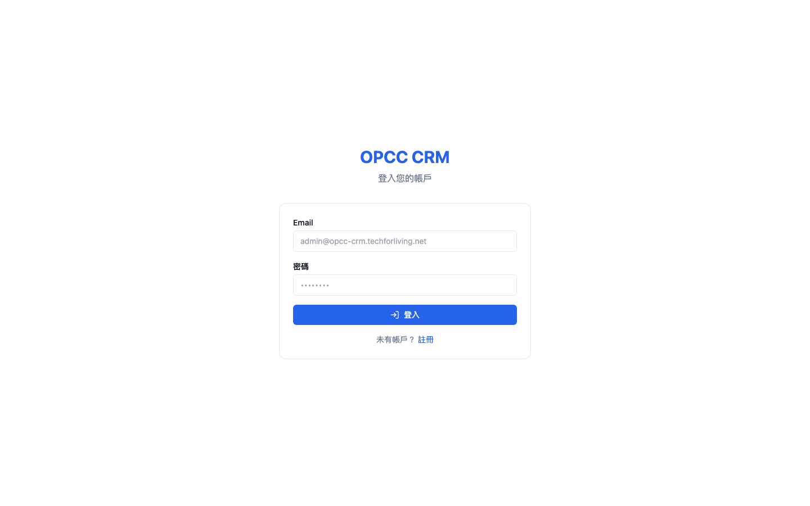
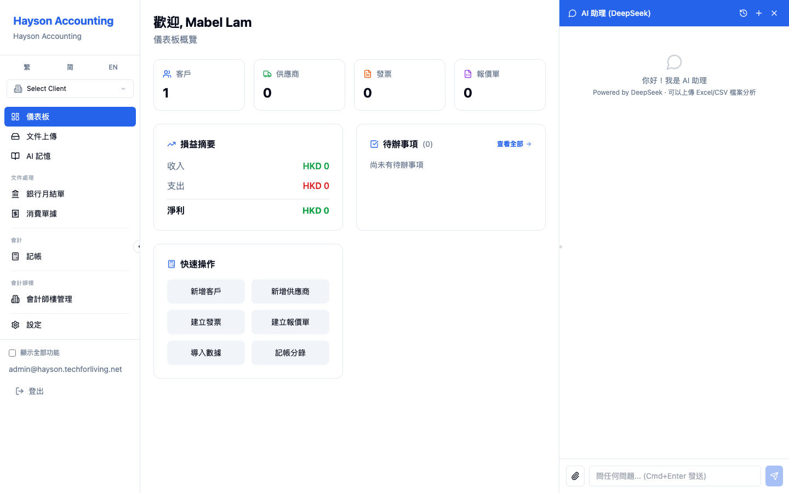
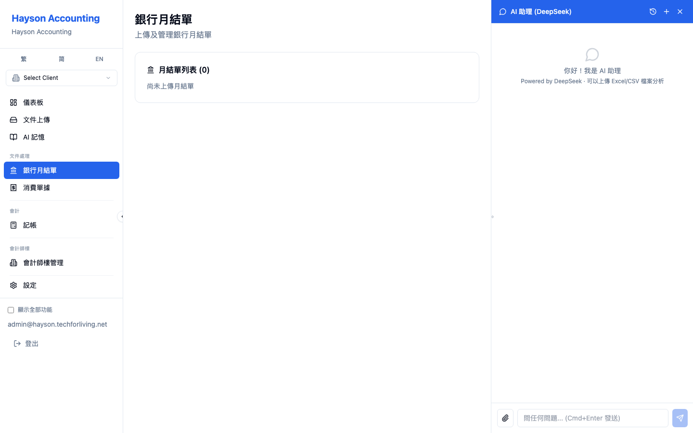
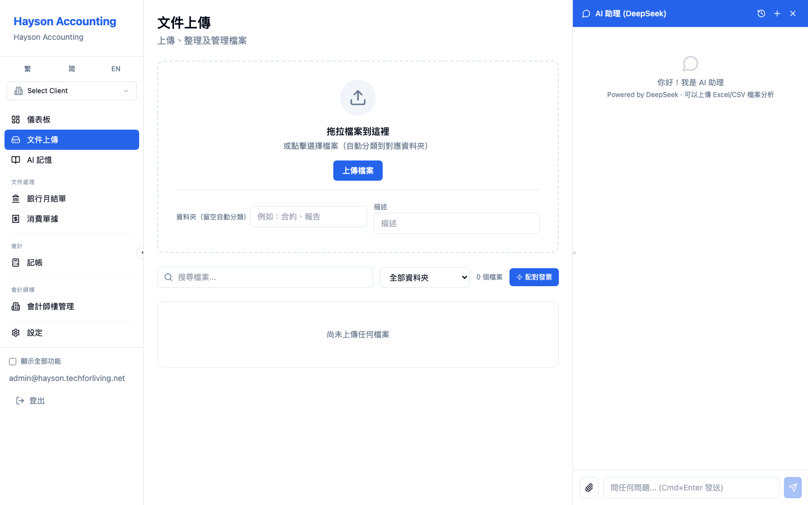
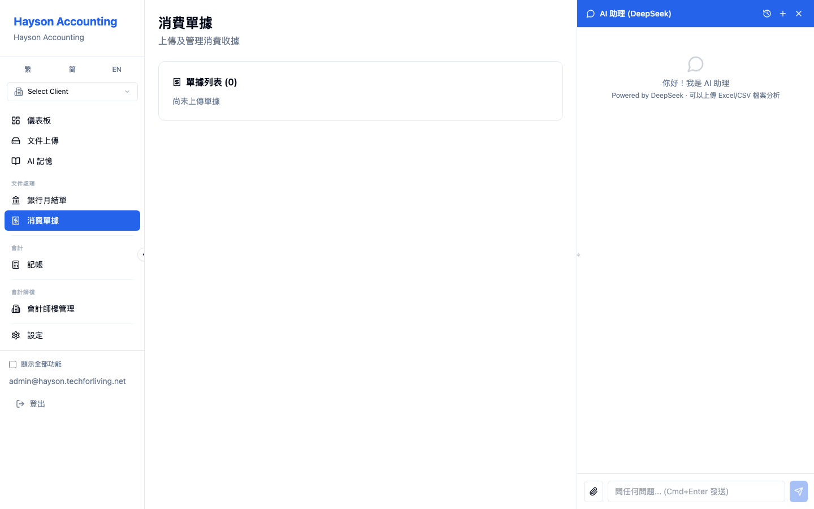
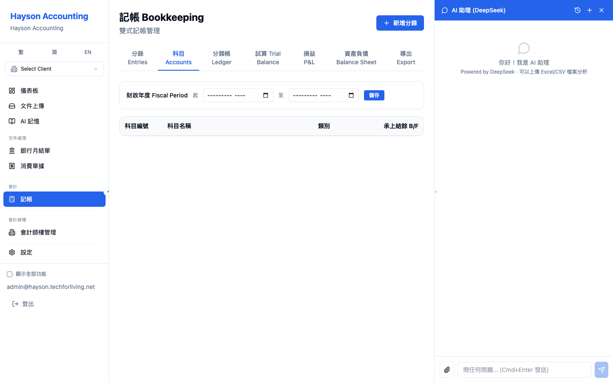
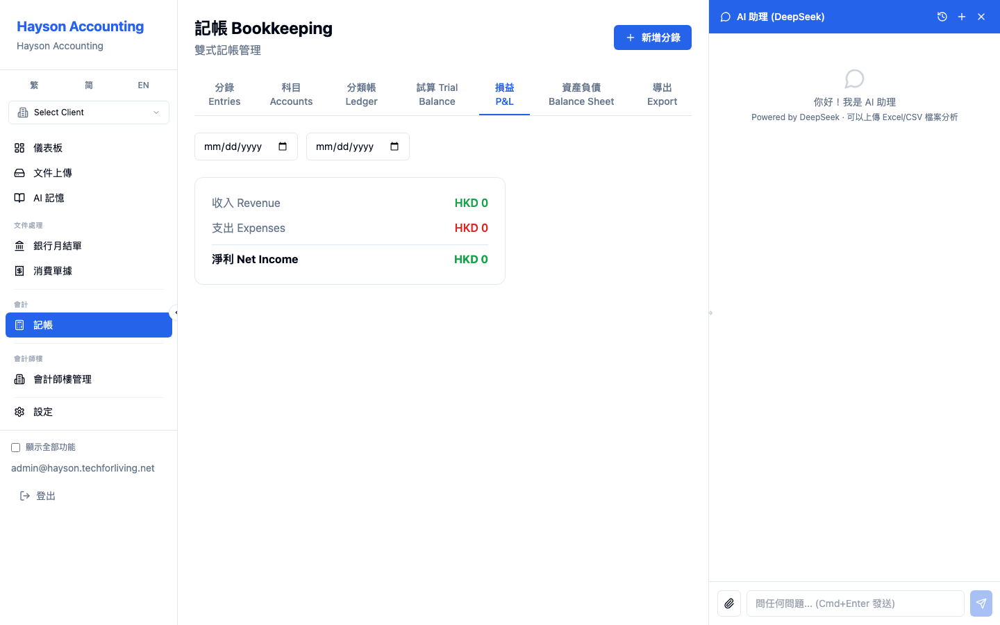
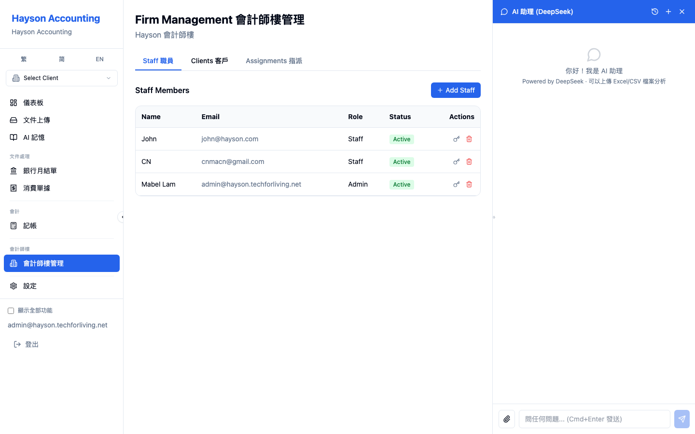
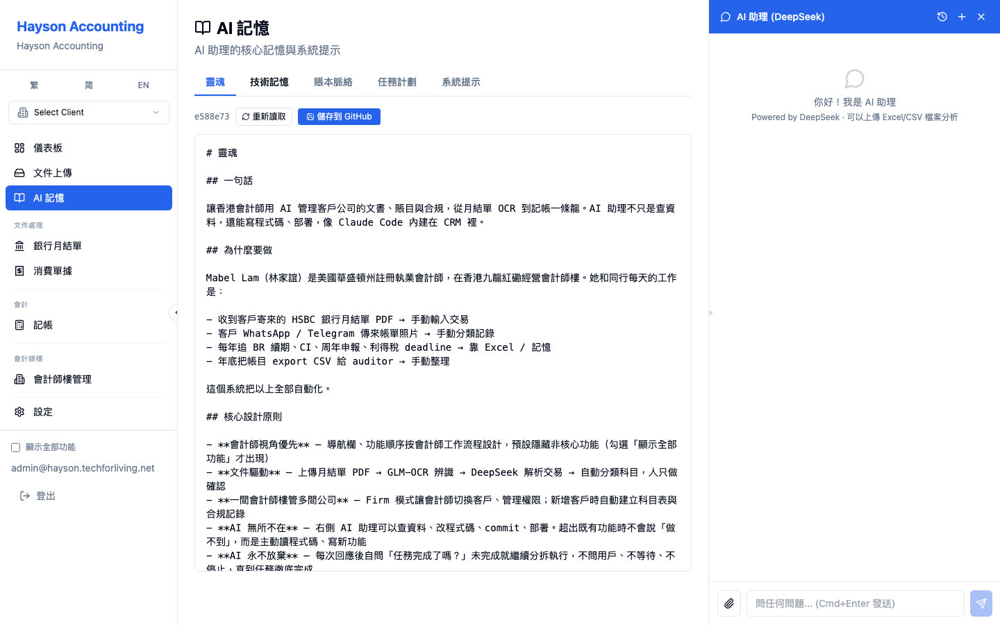

# OPCC CRM 使用說明書

> 版本：2026-05-21 | 環境：hayson.techforliving.net

---

## 1. 登入



1. 打開 `https://hayson.techforliving.net/login`
2. 輸入 Email 和密碼
3. 點「登入」

| 角色 | Email | 預設密碼 |
|------|-------|---------|
| 會計師樓管理員 | admin@example.com | your_password |
| EPRO 客戶 | client@example.com | your_password |

---

## 2. 整體佈局



登入後為三欄式佈局：
- **左側：** 導航欄 + Firm 下拉選單
- **中央：** 主要內容區
- **右側：** AI 助理面板（可拖曳調整寬度）

---

## 3. 導航欄

預設只顯示會計師常用功能，側欄底部勾選「顯示全部功能」可展開所有頁面。

```
儀表板
文件上傳
AI 記憶
── 文件處理 ──
銀行月結單
消費單據
── 會計 ──
記帳
── 會計師樓 ──
會計師樓管理
設定
☐ 顯示全部功能
```

---

## 4. Firm 下拉 — 切換客戶公司

導航欄上方有 Firm 下拉選單。管理員在此切換查看不同客戶公司的資料：

1. 點擊下拉 → 選擇客戶（如 EPRO TECHSOFT）
2. 所有頁面資料即時切換為該客戶資料
3. 選「Firm Overview」回到管理員視角

---

## 5. 儀表板

路徑：`/`


顯示公司概覽、關鍵數據摘要和損益摘要。

---

## 6. 銀行月結單

路徑：`/bank-statements`



### 6.1 月結單列表

顯示所有已導入的銀行月結單，包含銀行名稱、戶口號碼、期末結餘。點擊可展開交易明細。

### 6.2 交易明細

展開後顯示每筆交易：日期、描述、存入、提取、結餘、科目、關聯發票。

### 6.3 修改科目

- **下拉選擇：** 未分類交易可直接從下拉選單選擇科目
- **批量分類：** 點擊科目後可勾選相似交易一併套用
- **CSV 匯出/匯入：** 支援 CSV 格式

### 6.4 實際資料（EPRO TECHSOFT）

```
2026-04 HSBC 匯豐  636-438897-001  HKD 151,404.47
2026-03 HSBC 匯豐  636-438897-001  HKD 403,747.47
2026-02 HSBC 匯豐  636-438897-001  HKD 166,196.88
2026-01 HSBC 匯豐  636-438897-001  HKD 107,754.96
```

---

## 7. 文件上傳

路徑：`/file-storage`



- **上傳文件：** 拖放或點擊上傳 PDF / 圖片
- **自動分類：** 系統根據檔名自動分類（bank_statement、invoice、receipt 等）
- **自動 OCR：** 上傳後自動調用 GLM-OCR 辨識文字
- **自動導入：** 銀行月結單會自動解析交易並建立記錄

---

## 8. 消費單據

路徑：`/expense-receipts`



上傳和管理消費單據（收據、發票照片）。支援手動上傳和 Telegram Bot 自動導入。

---

## 9. 記帳

路徑：`/bookkeeping`



### 9.1 分錄 (Entries)

查看、新增、刪除日記帳分錄。支援日期範圍篩選。

### 9.2 科目 (Accounts)

- 顯示全部科目（5 位數 4 層級香港會計科目表）
- **承上結餘：** 每個科目可直接輸入期初餘額，Enter 或點 ✓ 儲存
- **財政年度：** 頁面頂部設定財政年度起迄

### 9.3 分類帳 (Ledger)

- 選擇科目查看該科目的所有分錄
- 顯示日期、描述、借方、貸方、餘額
- **自動產生分錄：** 「從銀行資料自動產生分錄」將銀行交易轉為日記帳分錄

### 9.4 損益表 (P&L)



收入、支出、淨利摘要。

### 9.5 試算表 / 資產負債表

- **試算表：** 所有科目的借方/貸方匯總
- **資產負債表：** 資產、負債、權益

### 9.6 導出 (Export)

選擇日期範圍，匯出 CSV 給審計師。

---

## 10. 會計師樓管理

路徑：`/firm/manage`



### 10.1 Staff 職員

- **新增員工：** 輸入 Email、角色、密碼 → 建立帳號
- **修改名字：** 點擊員工名字 → 跳出編輯框 → 改名
- **切換狀態：** 點擊 Active/Inactive 標籤切換
- **修改密碼：** 點擊鑰匙圖示 → 輸入新密碼
- **刪除員工：** 點擊垃圾桶圖示 → 確認後永久刪除

### 10.2 Clients 客戶

- **新增客戶：** 輸入公司名 + Email → 自動建立用戶、公司設定、合規記錄、科目表
- **封存客戶：** 將不再服務的客戶封存

### 10.3 Assignments 指派

設定哪些員工可以存取哪些客戶的資料（checkbox 方式管理）。

---

## 11. AI 助理

右側面板，可拖曳調整寬度。使用前置確認模式：

1. **你問：** 「目前有多少銀行月結單？」
2. **AI 回：** 「我準備呼叫：`call list_bank_statements`」
3. **你回：** 「好」
4. **AI 執行：** 回傳實際結果

### 常用指令

| 目的 | 指令 |
|------|------|
| 系統統計 | `call get_counts` |
| 銀行月結單 | `call list_bank_statements` |
| 員工列表 | `call list_staff` |
| Firm 資訊 | `call list_firms` |
| 新增員工 | `call add_staff_member` |
| 讀取程式碼 | `call read_code` |
| 寫入程式碼 | `call write_code` |
| 部署前端 | `call deploy_frontend` |

---

## 12. AI 記憶

路徑：`/ai-memory`



五個分頁：靈魂、技術記憶、賬本脈絡、任務計劃、系統提示。前三者可編輯並儲存回 GitHub。

---

## 13. 常見問題

**Q: 銀行月結單顯示 0 筆？**
A: 確認 Firm 下拉已選擇正確的客戶公司（如 EPRO TECHSOFT）。

**Q: AI 助理回覆亂碼？**
A: 重整頁面，或使用明確指令格式 `call <function_name>`。

**Q: 如何新增客戶公司？**
A: 會計師樓管理 → Clients → Add Client → 輸入公司名和 Email。

**Q: 如何修改科目承上結餘？**
A: 記帳 → 科目 → 直接在承上結餘欄輸入 → Enter 或點 ✓。
